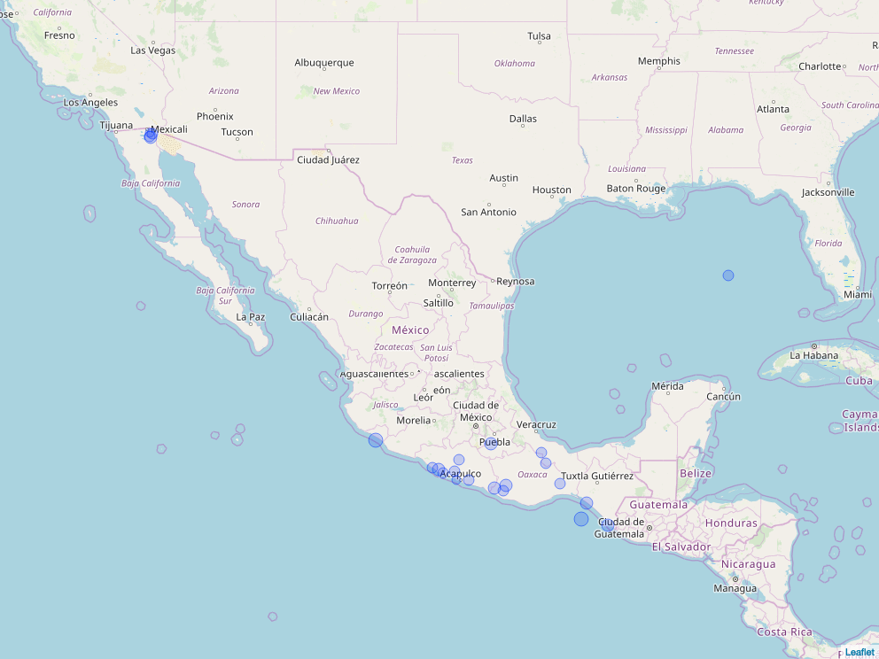

<!-- README.md is generated from README.Rmd. Please edit that file -->

# NOAAsignifEarthQuakes

<!-- badges: start -->

[](https://travis-ci.org/BreizhZut/NOAAsignifEarthQuakes)
<!-- badges: end -->

This package is the result of the [Mastering Software Developmentin
R](https://www.coursera.org/specializations/r) Capstone project. This
course proposed by Johns Hopkins University was created adn taught by
Roger D. Peng and Brooke Anderson of

This project is centered around a dataset obtained from the U.S.
National Oceanographic and Atmospheric Administration (NOAA). [Source:
National Geophysical Data Center / World Data Service (NGDC/WDS);
Significant Earthquake Database; NOAA.
doi:10.7289/V5TD9V7K](https://data.nodc.noaa.gov/cgi-bin/iso?id=gov.noaa.ngdc.mgg.hazards:G012153).
This dataset is focussed on significant earthquakes around the world and
contains information about 5,933 earthquakes over an approximately 4,000
year time span.

The goal of NOAAsignifEarthQuakes is to:

1.  Read and clean data from the National Oceanographic and Atmospheric
    Administration (NOAA) Significant Earthquake Database
2.  Provide exploratory visualization tools:
    1.  Timelines of earthquakes by countries
    2.  Mapping of earthquakes in a specific region

## Example

### Loading the package

``` r
library(NOAAsignifEarthQuakes)
library(magrittr)
```

### Reading and cleaning the data

``` r
## set the file input
file_noaa <- system.file("extdata","signif.txt",
                         package="NOAAsignifEarthQuakes",
                         mustWork=TRUE)
## Read and clean data
noaa <- load_NOAA_db(file_noaa) %>% eq_clean_data()
knitr::kable(tail(noaa))
```

| DATE       | COUNTRY   | LOCATION\_NAME       | LONGITUDE | LATITUDE | DEATHS | MAG |
| :--------- | :-------- | :------------------- | --------: | -------: | -----: | --: |
| 2018-09-08 | CHINA     | Mojiang Hani         |   101.552 |   23.332 |     NA | 5.6 |
| 2018-09-12 | INDIA     | West Bengal          |    90.165 |   26.374 |      1 | 5.3 |
| 2018-09-28 | INDONESIA | Sulawesi             |   119.840 |  \-0.178 |   2256 | 7.5 |
| 2018-10-07 | HAITI     | Port-Dex-Paix        |  \-72.975 |   20.041 |     18 | 5.9 |
| 2018-10-10 | INDONESIA | Madura Island, Java  |   114.453 |  \-7.456 |      4 | 6.0 |
| 2018-10-25 | GREECE    | Zakynthos, Strofades |    20.563 |   37.506 |     NA | 6.8 |

### Display a timeline

``` r
geom_timeline(noaa,
              mapping=ggplot2::aes(size=MAG,fill=DEATHS),
              countries='USA',
              xmin='2000-01-01',
              xmax='2017-01-01')
```

<!-- -->

### Display a timeline with labels

``` r
g <- geom_timeline(noaa,
                   mapping=ggplot2::aes(size=MAG,fill=DEATHS,y=COUNTRY),
                   countries=c('USA','China'),
                   xmin='2000-01-01',
                   xmax='2017-01-01') 
g + geom_timeline_label()
```

<!-- -->

### Display map of Earthquakes locations

``` r
filt_noaa <- noaa %>% dplyr::filter(COUNTRY == "MEXICO" & lubridate::year(DATE) >= 2000)
m <- eq_map(filt_noaa,annot_col = "popup_text")
```

The map is fully interactive, for documentation purposes we show the
following static version.

<!-- -->
